Check out my [final blog post](http://watanabesmith.rbind.io/post/ranked-black-mirror/) for an explanation of this repo, or the walkthrough [vignette](https://watanabesmith.rbind.io/post/behind-the-viz-ranked-black-mirror/)!

Raw data stored in [CompiledRedditRanks.csv](https://github.com/WatanabeSmith/BlackMirrorRanked/blob/master/CompiledRedditRanks.csv)


```r
library(tidyverse)
```

```
## -- Attaching packages ----------------------------------------------------- tidyverse 1.2.1 --
```

```
## v ggplot2 2.2.1     v purrr   0.2.4
## v tibble  1.4.2     v dplyr   0.7.4
## v tidyr   0.8.0     v stringr 1.3.0
## v readr   1.1.1     v forcats 0.3.0
```

```
## -- Conflicts -------------------------------------------------------- tidyverse_conflicts() --
## x dplyr::filter() masks stats::filter()
## x dplyr::lag()    masks stats::lag()
```

```r
library(forcats)
library(ggbeeswarm)

library(alluvial)
library(ggalluvial)
library(extrafont)
```

```
## Registering fonts with R
```

```r
colortable <- read_csv("color_palette.csv")
```

```
## Parsed with column specification:
## cols(
##   episode = col_character(),
##   color = col_character()
## )
```


```r
rawranks <- read_csv("CompiledRedditRanks.csv")
```

```
## Parsed with column specification:
## cols(
##   .default = col_integer(),
##   user = col_character(),
##   other = col_character()
## )
```

```
## See spec(...) for full column specifications.
```

```r
summary(rawranks)
```

```
##      user              other                 id        White Christmas
##  Length:111         Length:111         Min.   :  1.0   Min.   : 1.000  
##  Class :character   Class :character   1st Qu.: 28.5   1st Qu.: 2.000  
##  Mode  :character   Mode  :character   Median : 56.0   Median : 3.000  
##                                        Mean   : 56.0   Mean   : 4.546  
##                                        3rd Qu.: 83.5   3rd Qu.: 6.000  
##                                        Max.   :111.0   Max.   :19.000  
##                                                        NA's   :3       
##   San Junipero    USS Callister     Hang the DJ     Shut Up and Dance
##  Min.   : 1.000   Min.   : 1.000   Min.   : 1.000   Min.   : 1.000   
##  1st Qu.: 2.000   1st Qu.: 4.750   1st Qu.: 3.750   1st Qu.: 3.000   
##  Median : 4.000   Median : 7.000   Median : 6.000   Median : 5.000   
##  Mean   : 6.462   Mean   : 7.567   Mean   : 6.952   Mean   : 6.327   
##  3rd Qu.:10.250   3rd Qu.:10.250   3rd Qu.:10.000   3rd Qu.: 9.000   
##  Max.   :19.000   Max.   :17.000   Max.   :18.000   Max.   :18.000   
##  NA's   :7        NA's   :7        NA's   :7        NA's   :4        
##    White Bear     The Entire History of You    Nosedive     
##  Min.   : 1.000   Min.   : 1.000            Min.   : 1.000  
##  1st Qu.: 5.000   1st Qu.: 3.000            1st Qu.: 6.000  
##  Median : 8.000   Median : 6.000            Median : 8.000  
##  Mean   : 8.324   Mean   : 6.927            Mean   : 8.617  
##  3rd Qu.:12.000   3rd Qu.:10.000            3rd Qu.:12.000  
##  Max.   :17.000   Max.   :19.000            Max.   :18.000  
##  NA's   :6        NA's   :2                 NA's   :4       
##   Black Museum    Be Right Back    Fifteen Million Merits
##  Min.   : 1.000   Min.   : 1.000   Min.   : 1.000        
##  1st Qu.: 6.000   1st Qu.: 5.000   1st Qu.: 4.000        
##  Median : 9.000   Median : 9.000   Median : 8.000        
##  Mean   : 9.535   Mean   : 9.529   Mean   : 7.953        
##  3rd Qu.:13.000   3rd Qu.:14.000   3rd Qu.:11.500        
##  Max.   :19.000   Max.   :19.000   Max.   :19.000        
##  NA's   :10       NA's   :7        NA's   :4             
##  Hated in the Nation    Playtest     The National Anthem    Arkangel    
##  Min.   : 1          Min.   : 1.00   Min.   : 1.00       Min.   : 1.00  
##  1st Qu.: 6          1st Qu.: 8.00   1st Qu.: 9.00       1st Qu.:11.00  
##  Median :10          Median :12.00   Median :12.00       Median :14.00  
##  Mean   :10          Mean   :11.49   Mean   :11.51       Mean   :13.48  
##  3rd Qu.:14          3rd Qu.:15.00   3rd Qu.:15.00       3rd Qu.:16.50  
##  Max.   :19          Max.   :19.00   Max.   :19.00       Max.   :19.00  
##  NA's   :7           NA's   :6       NA's   :7           NA's   :8      
##    Crocodile    Men Against Fire   Metalhead     The Waldo Moment
##  Min.   : 1.0   Min.   : 4.00    Min.   : 3.00   Min.   : 1.00   
##  1st Qu.:11.0   1st Qu.:11.50    1st Qu.:11.00   1st Qu.:15.75   
##  Median :14.0   Median :15.00    Median :15.00   Median :18.00   
##  Mean   :13.1   Mean   :14.04    Mean   :14.25   Mean   :16.30   
##  3rd Qu.:16.0   3rd Qu.:17.00    3rd Qu.:18.00   3rd Qu.:19.00   
##  Max.   :19.0   Max.   :19.00    Max.   :19.00   Max.   :19.00   
##  NA's   :9      NA's   :8        NA's   :9       NA's   :7
```

```r
longranks <- rawranks %>%
  mutate(id = factor(id)) %>%
  gather(key = episode, value = ranking, -user, -other, -id)

by_avg_ranks <-longranks %>%
  group_by(episode) %>%
  summarise(avg_rank = mean(ranking, na.rm = TRUE)) %>% arrange(avg_rank) %>%
  mutate(episode = fct_inorder(episode))

ggplot(longranks, aes(y = ranking, x = factor(episode, levels = levels(by_avg_ranks$episode)))) +
  geom_boxplot() +
  scale_y_reverse()
```

```
## Warning: Removed 122 rows containing non-finite values (stat_boxplot).
```

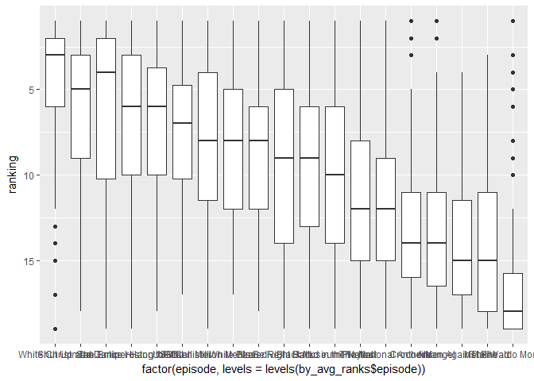<!-- -->

```r
longcolor <- longranks %>%
  left_join(colortable, by = "episode")

ggplot(longcolor, aes(y = ranking, x = factor(episode, levels = levels(by_avg_ranks$episode)),
                      color = color)) +
  scale_color_identity() +
  #geom_boxplot(outlier.shape = NA) +
  #geom_quasirandom() +
  geom_boxplot(fill = NA, outlier.shape = NA) +
  geom_jitter(height = 0.2, width = 0.2, size = 4, alpha = 0.6) +
  scale_y_reverse() +
  xlab("") +
  theme(axis.text = element_text(angle = 45, hjust = 1),
        panel.background = element_blank())
```

```
## Warning: Removed 122 rows containing non-finite values (stat_boxplot).
```

```
## Warning: Removed 122 rows containing missing values (geom_point).
```

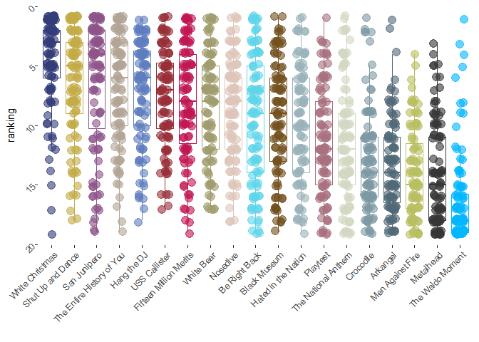<!-- -->

Top vote getter

```r
n_users <- longranks %>% filter(ranking == 1) %>% nrow()

votecount <- longranks %>%
  filter(ranking == 1) %>%
  group_by(episode) %>%
  summarise(votes = n(), pct = n() / n_users) %>%
  arrange(desc(pct))

votecolor <- votecount %>%
  left_join(colortable, by = "episode")

ggplot(votecolor, aes(x = fct_inorder(episode), y = pct,
                      color = color, fill = color)) +
  scale_color_identity() +
  scale_fill_identity() +
  geom_bar(stat = "identity") +
  theme(panel.background = element_blank(),
        axis.ticks = element_blank(),
        axis.text.x = element_text(angle = 45, hjust = 1),
        axis.title = element_blank(),
        text = element_text(family = "Century Gothic", face = "bold"),
        plot.title = element_text(hjust = 0.5, size = 20),
        plot.subtitle = element_text(hjust = 0.5, size = 16)) +  
  xlab("") +
  ylab("Percent of 1st place votes")
```

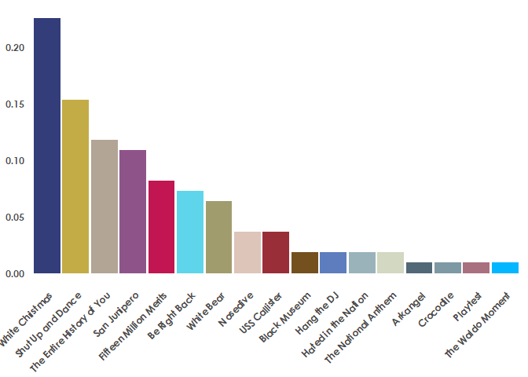<!-- -->

Jungle primary

```r
toptwo <- longranks %>% filter(episode == "White Christmas" | episode == "Shut Up and Dance")

runoff_final <- toptwo %>% arrange(ranking) %>%
  filter(!is.na(ranking)) %>%
  .[!duplicated(.$id),] %>%
  group_by(episode) %>%
  summarise(votes = n(), pct = n() / n_users) %>%
  arrange(desc(pct))

ggplot(runoff_final, aes(x = fct_inorder(episode), y = pct)) +
  geom_bar(stat = "identity")
```

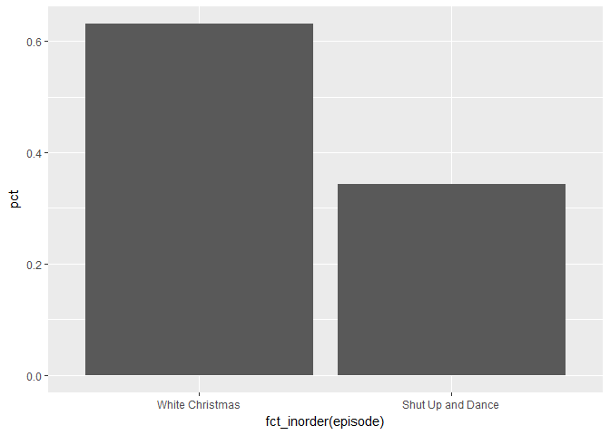<!-- -->

Ranked preference


```r
removed_episodes <- vector()

roundone <- longranks %>%
  arrange(ranking) %>%
  filter(!is.na(ranking)) %>%
  .[!duplicated(.$id),] %>%
  group_by(episode) %>%
  summarise(votes = n(), pct = n() / n_users) %>%
  arrange(desc(pct))

ggplot(roundone, aes(x = fct_inorder(episode), y = pct)) +
  geom_bar(stat = "identity") +
  theme(axis.text.x = element_text(angle = 45))
```

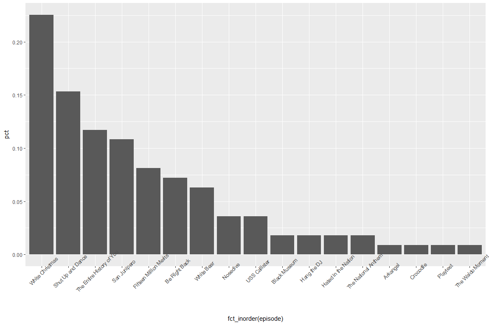<!-- -->

```r
removed_episodes <- append(removed_episodes, c("The Waldo Moment", "Playtest", "Crocodile", "Arkangel", "Metalhead", "Men Against Fire"))


roundtwo <- longranks %>%
  filter(!episode %in% removed_episodes) %>%
  arrange(ranking) %>%
  filter(!is.na(ranking)) %>%
  .[!duplicated(.$id),] %>%
  group_by(episode) %>%
  summarise(votes = n(), pct = n() / n_users) %>%
  arrange(desc(pct))

ggplot(roundtwo, aes(x = fct_inorder(episode), y = pct)) +
  geom_bar(stat = "identity") +
  theme(axis.text.x = element_text(angle = 45))
```

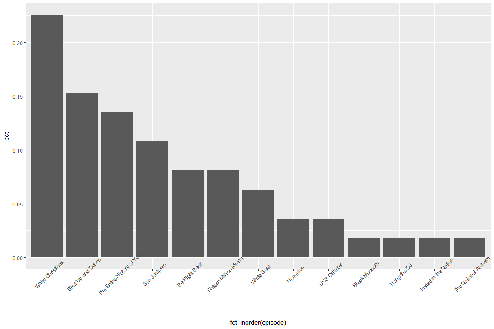<!-- -->

```r
removed_episodes <- append(removed_episodes, c("Black Museum", "Hang the DJ", "Hated in the Nation", "The National Anthem"))

roundthree <- longranks %>%
  filter(!episode %in% removed_episodes) %>%
  arrange(ranking) %>%
  filter(!is.na(ranking)) %>%
  .[!duplicated(.$id),] %>%
  group_by(episode) %>%
  summarise(votes = n(), pct = n() / n_users) %>%
  arrange(desc(pct))

ggplot(roundthree, aes(x = fct_inorder(episode), y = pct)) +
  geom_bar(stat = "identity") +
  theme(axis.text.x = element_text(angle = 45))
```

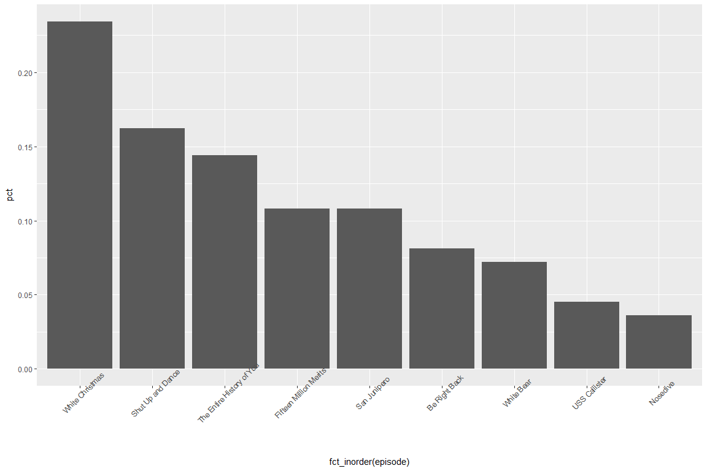<!-- -->

```r
removed_episodes <- append(removed_episodes, c("Nosedive"))

roundfour <- longranks %>%
  filter(!episode %in% removed_episodes) %>%
  arrange(ranking) %>%
  filter(!is.na(ranking)) %>%
  .[!duplicated(.$id),] %>%
  group_by(episode) %>%
  summarise(votes = n(), pct = n() / n_users) %>%
  arrange(desc(pct))

ggplot(roundfour, aes(x = fct_inorder(episode), y = pct)) +
  geom_bar(stat = "identity") +
  theme(axis.text.x = element_text(angle = 45))
```

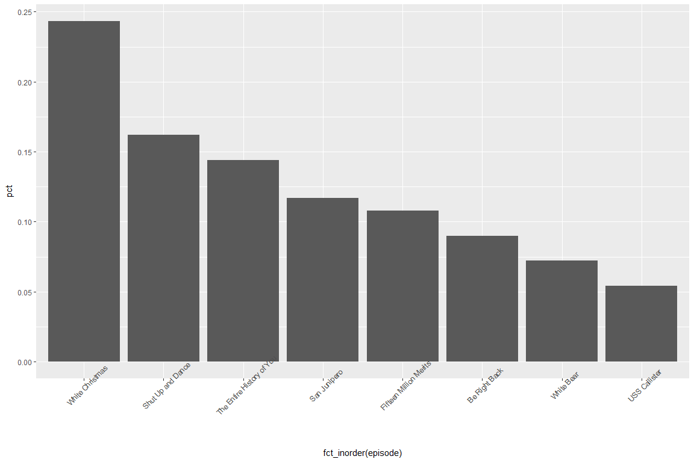<!-- -->

```r
removed_episodes <- append(removed_episodes, c("USS Callister"))

round5<- longranks %>%
  filter(!episode %in% removed_episodes) %>%
  arrange(ranking) %>%
  filter(!is.na(ranking)) %>%
  .[!duplicated(.$id),] %>%
  group_by(episode) %>%
  summarise(votes = n(), pct = n() / n_users) %>%
  arrange(desc(pct))

ggplot(round5, aes(x = fct_inorder(episode), y = pct)) +
  geom_bar(stat = "identity") +
  theme(axis.text.x = element_text(angle = 45))
```

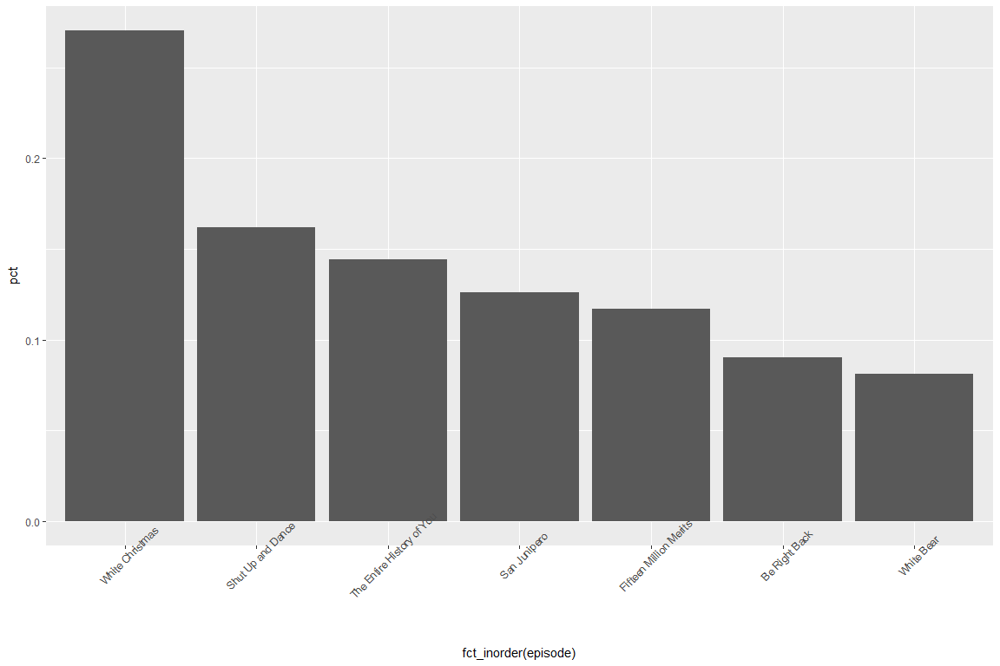<!-- -->

```r
removed_episodes <- append(removed_episodes, c("White Bear"))

round6<- longranks %>%
  filter(!episode %in% removed_episodes) %>%
  arrange(ranking) %>%
  filter(!is.na(ranking)) %>%
  .[!duplicated(.$id),] %>%
  group_by(episode) %>%
  summarise(votes = n(), pct = n() / n_users) %>%
  arrange(desc(pct))

ggplot(round6, aes(x = fct_inorder(episode), y = pct)) +
  geom_bar(stat = "identity") +
  theme(axis.text.x = element_text(angle = 45))
```

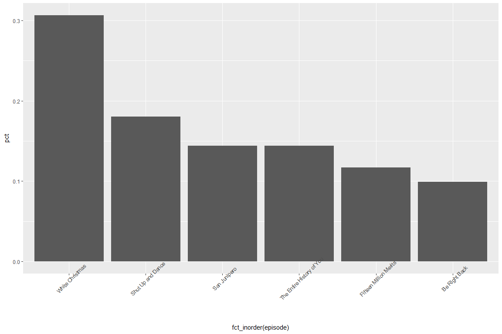<!-- -->

```r
removed_episodes <- append(removed_episodes, c("Be Right Back"))

round7 <- longranks %>%
  filter(!episode %in% removed_episodes) %>%
  arrange(ranking) %>%
  filter(!is.na(ranking)) %>%
  .[!duplicated(.$id),] %>%
  group_by(episode) %>%
  summarise(votes = n(), pct = n() / n_users) %>%
  arrange(desc(pct))

ggplot(round7, aes(x = fct_inorder(episode), y = pct)) +
  geom_bar(stat = "identity") +
  theme(axis.text.x = element_text(angle = 45))
```

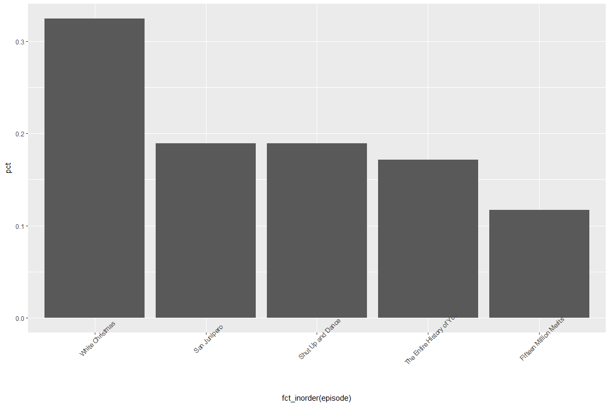<!-- -->

```r
removed_episodes <- append(removed_episodes, c("Fifteen Million Merits"))

round8 <- longranks %>%
  filter(!episode %in% removed_episodes) %>%
  arrange(ranking) %>%
  filter(!is.na(ranking)) %>%
  .[!duplicated(.$id),] %>%
  group_by(episode) %>%
  summarise(votes = n(), pct = n() / n_users) %>%
  arrange(desc(pct))

ggplot(round8, aes(x = fct_inorder(episode), y = pct)) +
  geom_bar(stat = "identity") +
  theme(axis.text.x = element_text(angle = 45))
```

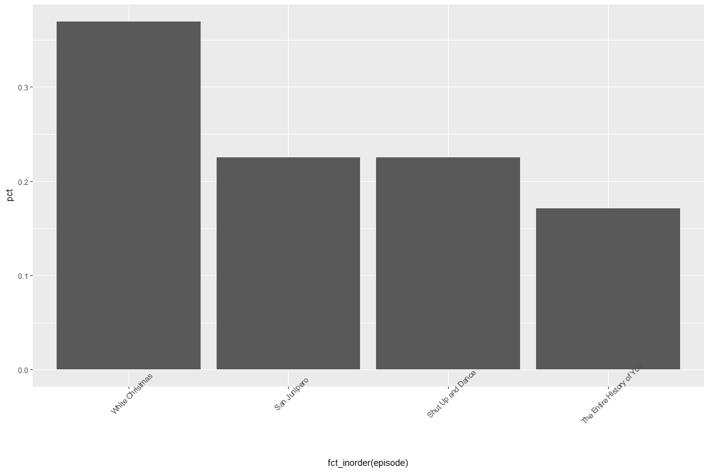<!-- -->

```r
removed_episodes <- append(removed_episodes, c("The Entire History of You"))

round9 <- longranks %>%
  filter(!episode %in% removed_episodes) %>%
  arrange(ranking) %>%
  filter(!is.na(ranking)) %>%
  .[!duplicated(.$id),] %>%
  group_by(episode) %>%
  summarise(votes = n(), pct = n() / n_users) %>%
  arrange(desc(pct))

ggplot(round9, aes(x = fct_inorder(episode), y = pct)) +
  geom_bar(stat = "identity") +
  theme(axis.text.x = element_text(angle = 45))
```

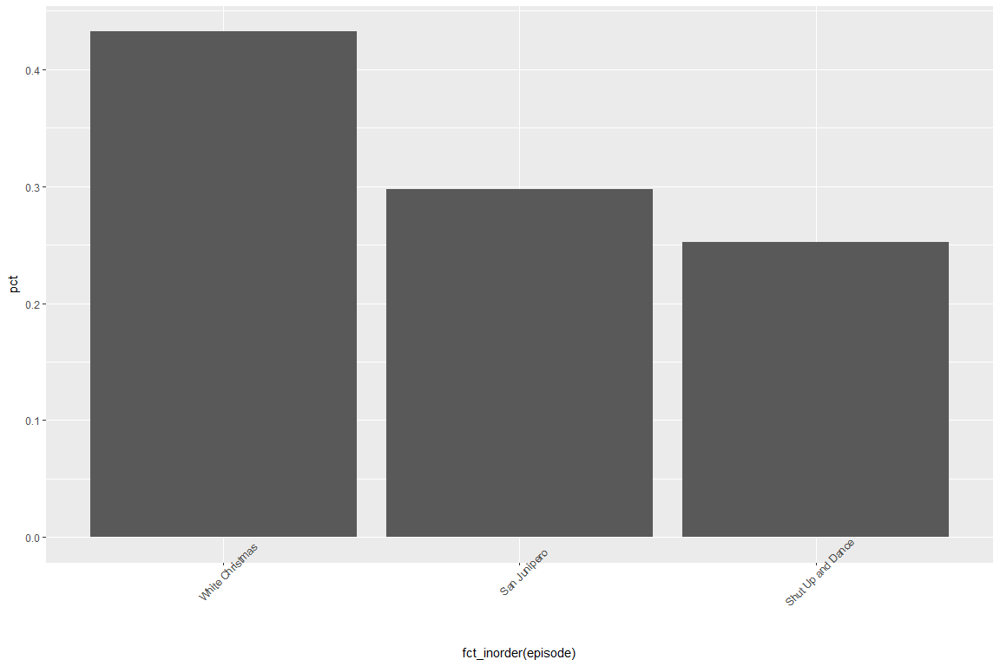<!-- -->

```r
removed_episodes <- append(removed_episodes, c("Shut Up and Dance"))

round10 <- longranks %>%
  filter(!episode %in% removed_episodes) %>%
  arrange(ranking) %>%
  filter(!is.na(ranking)) %>%
  .[!duplicated(.$id),] %>%
  group_by(episode) %>%
  summarise(votes = n(), pct = n() / n_users) %>%
  arrange(desc(pct))

ggplot(round10, aes(x = fct_inorder(episode), y = pct)) +
  geom_bar(stat = "identity") +
  theme(axis.text.x = element_text(angle = 45))
```

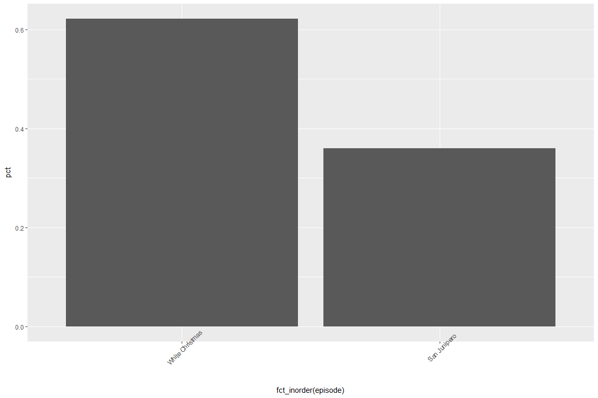<!-- -->


```r
alluranks <- longranks %>%
  select(a_id = id) %>% unique()

longcomplete <- longranks %>%
  filter(!is.na(ranking))

episode_list <- longcomplete %>%
  select(episode) %>% unique() %>% .$episode %>% as.character()

user <- vector()
r_ep <- vector()
r_round <- vector()
roundcounter <- 0

while(length(episode_list) > 1){
  roundcounter <- roundcounter + 1

  for(i in alluranks$a_id) {
    choice <- longcomplete %>%
      filter(episode %in% episode_list) %>%
      filter(id == i) %>%
      arrange(ranking) %>% .$episode %>% .[1]

    if(is.na(choice)) {next}

    user <- append(user, i)
    r_ep <- append(r_ep, choice)
    r_round <- append(r_round, roundcounter)
  }

  growing_df <- data.frame(id = user, round = r_round, episode = r_ep)

  episode_list <- growing_df %>%
    filter(r_round == roundcounter & !is.na(episode)) %>%
    group_by(episode) %>% count() %>%
    ungroup() %>% filter(n > min(n)) %>% .$episode %>% as.character()

  print(episode_list)

}
```

```
##  [1] "Be Right Back"             "Black Museum"             
##  [3] "Fifteen Million Merits"    "Hang the DJ"              
##  [5] "Hated in the Nation"       "Nosedive"                 
##  [7] "San Junipero"              "Shut Up and Dance"        
##  [9] "The Entire History of You" "The National Anthem"      
## [11] "USS Callister"             "White Bear"               
## [13] "White Christmas"          
## [1] "Be Right Back"             "Fifteen Million Merits"   
## [3] "Nosedive"                  "San Junipero"             
## [5] "Shut Up and Dance"         "The Entire History of You"
## [7] "USS Callister"             "White Bear"               
## [9] "White Christmas"          
## [1] "Be Right Back"             "Fifteen Million Merits"   
## [3] "San Junipero"              "Shut Up and Dance"        
## [5] "The Entire History of You" "USS Callister"            
## [7] "White Bear"                "White Christmas"          
## [1] "Be Right Back"             "Fifteen Million Merits"   
## [3] "San Junipero"              "Shut Up and Dance"        
## [5] "The Entire History of You" "White Bear"               
## [7] "White Christmas"          
## [1] "Be Right Back"             "Fifteen Million Merits"   
## [3] "San Junipero"              "Shut Up and Dance"        
## [5] "The Entire History of You" "White Christmas"          
## [1] "Fifteen Million Merits"    "San Junipero"             
## [3] "Shut Up and Dance"         "The Entire History of You"
## [5] "White Christmas"          
## [1] "San Junipero"              "Shut Up and Dance"        
## [3] "The Entire History of You" "White Christmas"          
## [1] "San Junipero"      "Shut Up and Dance" "White Christmas"  
## [1] "San Junipero"    "White Christmas"
## [1] "White Christmas"
```

```r
#choice_lodes <- to_lodes(growing_df, axes = 1:2)

#ggplot(choice_lodes, aes(x = round, stratum = episode, alluvim = id)) +
 # geom_flow()

growing_df$episode <- as.factor(growing_df$episode)
growing_df$id <- as.factor(growing_df$id)

growing_df_color <- growing_df %>% left_join(colortable, by="episode")
```

```
## Warning: Column `episode` joining factor and character vector, coercing
## into character vector
```

```r
ggplot(growing_df_color, aes(x = round, stratum = episode, alluvium = id,
                       fill = color, label = episode)) +
  theme(panel.background = element_blank(),
        axis.ticks = element_blank(),
        axis.text = element_blank(),
        axis.title = element_blank(),
        text = element_text(family = "Century Gothic", face = "bold"),
        plot.title = element_text(hjust = 0.5, size = 20),
        plot.subtitle = element_text(hjust = 0.5, size = 16)) +
  geom_flow(stat = "alluvium", lode.guidance = "leftright") +
  geom_stratum(size = 0, color = NA) +
  scale_fill_identity() +
  ggtitle("Ranked Choice Voting for Black Mirror Episodes") +
  labs(subtitle = "All episodes") +
  geom_text(stat = "stratum", family = "Century Gothic", fontface = "bold", color = "gray15")
```

```
## Warning in is_alluvial_lodes(data, key = "x", value = "stratum", id =
## "alluvium", : Missing id-axis pairings.
```

```
## Warning in is_alluvial_lodes(data, key = "x", value = "stratum", id =
## "alluvium", : Missing id-axis pairings.

## Warning in is_alluvial_lodes(data, key = "x", value = "stratum", id =
## "alluvium", : Missing id-axis pairings.
```

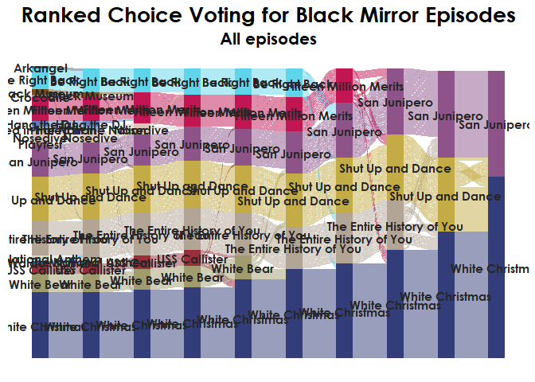<!-- -->

```r
# majors$curriculum <- as.factor(majors$curriculum)
# ggplot(majors,
#        aes(x = semester, stratum = curriculum, alluvium = student,
#            fill = curriculum, label = curriculum)) +
#   scale_fill_brewer(type = "qual", palette = "Set2") +
#   geom_flow(stat = "alluvium", lode.guidance = "rightleft",
#             color = "darkgray") +
#   geom_stratum() +
#   theme(legend.position = "bottom") +
#   ggtitle("student curricula across several semesters")
```

Non white christmas run


```r
noWC <- longcomplete %>%
  filter(episode != "White Christmas")

noWC_firstvotes <- noWC %>%
  group_by(episode) %>%
  arrange(ranking) %>%
  .[!duplicated(.$id),] %>%
  summarise(votes = n(), pct = n() / n_users) %>%
  arrange(desc(pct))

ggplot(noWC_firstvotes, aes(x = fct_inorder(episode), y = pct)) +
  geom_bar(stat = "identity") +
  theme(axis.text.x = element_text(angle=45, hjust = 1))
```

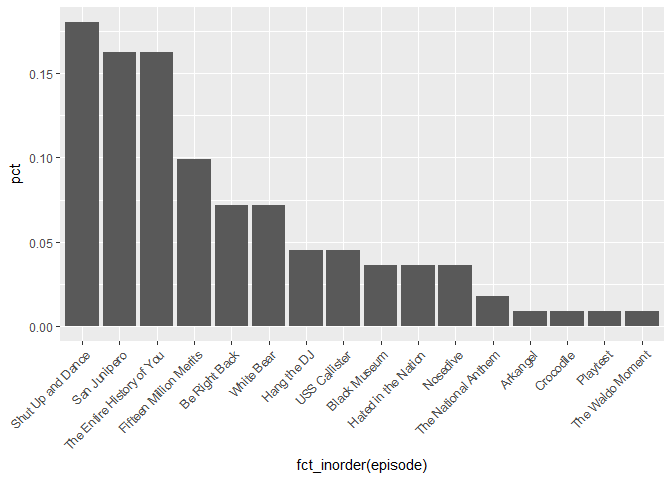<!-- -->

Non white christmas ranked choice


```r
noWC_ids <- noWC %>%
  select(a_id = id) %>% unique()

episode_list <- noWC %>%
  select(episode) %>% unique() %>% .$episode %>% as.character()

user <- vector()
r_ep <- vector()
r_round <- vector()
roundcounter <- 0

while(length(episode_list) > 1){
  roundcounter <- roundcounter + 1

  for(i in noWC_ids$a_id) {
    choice <- noWC %>%
      filter(episode %in% episode_list) %>%
      filter(id == i) %>%
      arrange(ranking) %>% .$episode %>% .[1]

    if(is.na(choice)) {next}

    user <- append(user, i)
    r_ep <- append(r_ep, choice)
    r_round <- append(r_round, roundcounter)
  }

  noWC_df <- data.frame(id = user, round = r_round, episode = r_ep)

  episode_list <- noWC_df %>%
    filter(r_round == roundcounter & !is.na(episode)) %>%
    group_by(episode) %>% count() %>%
    ungroup() %>% filter(n > min(n)) %>% .$episode %>% as.character()

  print(episode_list)

}
```

```
##  [1] "Be Right Back"             "Black Museum"             
##  [3] "Fifteen Million Merits"    "Hang the DJ"              
##  [5] "Hated in the Nation"       "Nosedive"                 
##  [7] "San Junipero"              "Shut Up and Dance"        
##  [9] "The Entire History of You" "The National Anthem"      
## [11] "USS Callister"             "White Bear"               
##  [1] "Be Right Back"             "Black Museum"             
##  [3] "Fifteen Million Merits"    "Hang the DJ"              
##  [5] "Hated in the Nation"       "Nosedive"                 
##  [7] "San Junipero"              "Shut Up and Dance"        
##  [9] "The Entire History of You" "USS Callister"            
## [11] "White Bear"               
## [1] "Be Right Back"             "Fifteen Million Merits"   
## [3] "Hang the DJ"               "San Junipero"             
## [5] "Shut Up and Dance"         "The Entire History of You"
## [7] "USS Callister"             "White Bear"               
## [1] "Be Right Back"             "Fifteen Million Merits"   
## [3] "San Junipero"              "Shut Up and Dance"        
## [5] "The Entire History of You" "USS Callister"            
## [7] "White Bear"               
## [1] "Be Right Back"             "Fifteen Million Merits"   
## [3] "San Junipero"              "Shut Up and Dance"        
## [5] "The Entire History of You" "White Bear"               
## [1] "Fifteen Million Merits"    "San Junipero"             
## [3] "Shut Up and Dance"         "The Entire History of You"
## [5] "White Bear"               
## [1] "Fifteen Million Merits"    "San Junipero"             
## [3] "Shut Up and Dance"         "The Entire History of You"
## [1] "San Junipero"              "Shut Up and Dance"        
## [3] "The Entire History of You"
## [1] "San Junipero"      "Shut Up and Dance"
## [1] "San Junipero"
```

```r
#choice_lodes <- to_lodes(growing_df, axes = 1:2)

#ggplot(choice_lodes, aes(x = round, stratum = episode, alluvim = id)) +
 # geom_flow()

noWC_df$episode <- as.factor(noWC_df$episode)
noWC_df$id <- as.factor(noWC_df$id)

ggplot(noWC_df, aes(x = round, stratum = episode, alluvium = id,
                       fill = episode, label = episode)) +
  geom_flow(stat = "alluvium", lode.guidance = "leftright") +
  geom_stratum() +
  geom_text(stat = "stratum", label.strata = TRUE)
```

```
## Warning in is_alluvial_lodes(data, key = "x", value = "stratum", id =
## "alluvium", : Missing id-axis pairings.

## Warning in is_alluvial_lodes(data, key = "x", value = "stratum", id =
## "alluvium", : Missing id-axis pairings.

## Warning in is_alluvial_lodes(data, key = "x", value = "stratum", id =
## "alluvium", : Missing id-axis pairings.
```

```
## Warning in f(..., self = self): Aesthetic 'label' is specified, so
## parameter 'label.strata' will be ignored.
```

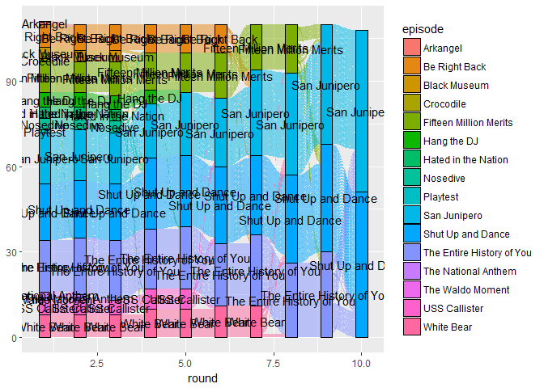<!-- -->

Add in a category for Exhausted


```r
noWC_ids <- noWC %>%
  select(a_id = id) %>% unique()

episode_list <- noWC %>%
  select(episode) %>% unique() %>% .$episode %>% as.character()

user <- vector()
r_ep <- vector()
r_round <- vector()
roundcounter <- 0

while(length(episode_list) > 1){
  roundcounter <- roundcounter + 1

  for(i in noWC_ids$a_id) {
    choice <- noWC %>%
      filter(episode %in% episode_list) %>%
      filter(id == i) %>%
      arrange(ranking) %>% .$episode %>% .[1]

    if(is.na(choice)) {choice <- "-"}

    user <- append(user, i)
    r_ep <- append(r_ep, choice)
    r_round <- append(r_round, roundcounter)
  }

  noWC_df <- data.frame(id = user, round = r_round, episode = r_ep)

  episode_list <- noWC_df %>%
    filter(r_round == roundcounter & !is.na(episode) & episode != "-") %>%
    group_by(episode) %>% count() %>%
    ungroup() %>% filter(n > min(n)) %>% .$episode %>% as.character()

  print(episode_list)

}
```

```
##  [1] "Be Right Back"             "Black Museum"             
##  [3] "Fifteen Million Merits"    "Hang the DJ"              
##  [5] "Hated in the Nation"       "Nosedive"                 
##  [7] "San Junipero"              "Shut Up and Dance"        
##  [9] "The Entire History of You" "The National Anthem"      
## [11] "USS Callister"             "White Bear"               
##  [1] "Be Right Back"             "Black Museum"             
##  [3] "Fifteen Million Merits"    "Hang the DJ"              
##  [5] "Hated in the Nation"       "Nosedive"                 
##  [7] "San Junipero"              "Shut Up and Dance"        
##  [9] "The Entire History of You" "USS Callister"            
## [11] "White Bear"               
## [1] "Be Right Back"             "Fifteen Million Merits"   
## [3] "Hang the DJ"               "San Junipero"             
## [5] "Shut Up and Dance"         "The Entire History of You"
## [7] "USS Callister"             "White Bear"               
## [1] "Be Right Back"             "Fifteen Million Merits"   
## [3] "San Junipero"              "Shut Up and Dance"        
## [5] "The Entire History of You" "USS Callister"            
## [7] "White Bear"               
## [1] "Be Right Back"             "Fifteen Million Merits"   
## [3] "San Junipero"              "Shut Up and Dance"        
## [5] "The Entire History of You" "White Bear"               
## [1] "Fifteen Million Merits"    "San Junipero"             
## [3] "Shut Up and Dance"         "The Entire History of You"
## [5] "White Bear"               
## [1] "Fifteen Million Merits"    "San Junipero"             
## [3] "Shut Up and Dance"         "The Entire History of You"
## [1] "San Junipero"              "Shut Up and Dance"        
## [3] "The Entire History of You"
## [1] "San Junipero"      "Shut Up and Dance"
## [1] "San Junipero"
```

```r
noWC_df$episode <- as.factor(noWC_df$episode)
noWC_df$id <- as.factor(noWC_df$id)

ggplot(noWC_df, aes(x = round, stratum = episode, alluvium = id,
                       fill = episode, label = episode)) +
  geom_flow(stat = "alluvium", lode.guidance = "leftright") +
  geom_stratum() +
  geom_text(stat = "stratum", label.strata = TRUE)
```

```
## Warning in f(..., self = self): Aesthetic 'label' is specified, so
## parameter 'label.strata' will be ignored.
```

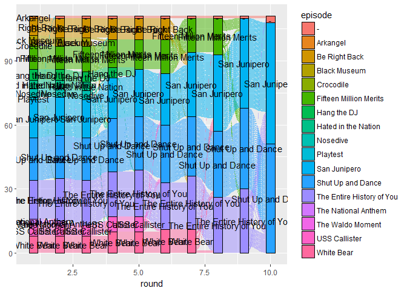<!-- -->


```r
colortable <- read_csv("color_palette.csv")
```

```
## Parsed with column specification:
## cols(
##   episode = col_character(),
##   color = col_character()
## )
```

```r
noWC_color <- noWC_df %>% left_join(colortable, by = "episode")
```

```
## Warning: Column `episode` joining factor and character vector, coercing
## into character vector
```

```r
ggplot(noWC_color, aes(x = round, stratum = episode, alluvium = id,
                       fill = color, label = episode)) +
  theme(panel.background = element_blank(),
        axis.ticks = element_blank(),
        axis.text = element_blank(),
        axis.title = element_blank(),
        text = element_text(family = "Century Gothic", face = "bold"),
        plot.title = element_text(hjust = 0.5, size = 20),
        plot.subtitle = element_text(hjust = 0.5, size = 16)) +
  geom_flow(stat = "alluvium", lode.guidance = "leftright") +
  geom_stratum(size = 0, color = NA) +
  scale_fill_identity() +
  ggtitle("Ranked Choice Voting for Black Mirror Episodes") +
  labs(subtitle = "Non-Jon Hamm edition") +
  geom_text(stat = "stratum", family = "Century Gothic", fontface = "bold", color = "gray15")
```

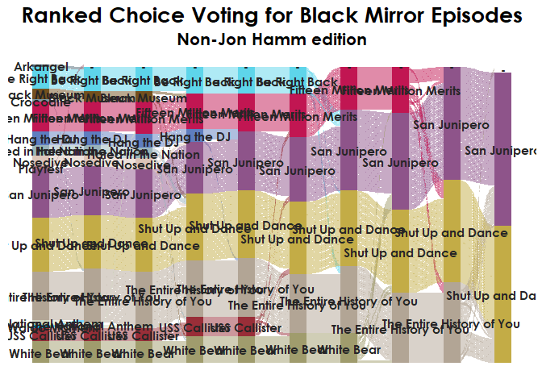<!-- -->


```r
noWC_ids <- noWC %>%
  select(a_id = id) %>% unique()

episode_list <- noWC %>%
  select(episode) %>% unique() %>% .$episode %>% as.character()

user <- vector()
r_ep <- vector()
r_round <- vector()
roundcounter <- 0

while(length(episode_list) > 1){
  roundcounter <- roundcounter + 1

  for(i in noWC_ids$a_id) {
    choice <- noWC %>%
      filter(episode %in% episode_list) %>%
      filter(id == i) %>%
      arrange(ranking) %>% .$episode %>% .[1]

    #if(is.na(choice)) {next}
    if(is.na(choice)) {choice <- "-"}

    user <- append(user, i)
    r_ep <- append(r_ep, choice)
    r_round <- append(r_round, roundcounter)
  }

  noWC_df <- data.frame(id = user, round = r_round, episode = r_ep)

  episode_list <- noWC_df %>%
    filter(r_round == roundcounter & !is.na(episode) & episode != "-") %>%
    group_by(episode) %>% count() %>%
    ungroup() %>% filter(n > min(n)) %>% .$episode %>% as.character()

  print(episode_list)

}
```

```
##  [1] "Be Right Back"             "Black Museum"             
##  [3] "Fifteen Million Merits"    "Hang the DJ"              
##  [5] "Hated in the Nation"       "Nosedive"                 
##  [7] "San Junipero"              "Shut Up and Dance"        
##  [9] "The Entire History of You" "The National Anthem"      
## [11] "USS Callister"             "White Bear"               
##  [1] "Be Right Back"             "Black Museum"             
##  [3] "Fifteen Million Merits"    "Hang the DJ"              
##  [5] "Hated in the Nation"       "Nosedive"                 
##  [7] "San Junipero"              "Shut Up and Dance"        
##  [9] "The Entire History of You" "USS Callister"            
## [11] "White Bear"               
## [1] "Be Right Back"             "Fifteen Million Merits"   
## [3] "Hang the DJ"               "San Junipero"             
## [5] "Shut Up and Dance"         "The Entire History of You"
## [7] "USS Callister"             "White Bear"               
## [1] "Be Right Back"             "Fifteen Million Merits"   
## [3] "San Junipero"              "Shut Up and Dance"        
## [5] "The Entire History of You" "USS Callister"            
## [7] "White Bear"               
## [1] "Be Right Back"             "Fifteen Million Merits"   
## [3] "San Junipero"              "Shut Up and Dance"        
## [5] "The Entire History of You" "White Bear"               
## [1] "Fifteen Million Merits"    "San Junipero"             
## [3] "Shut Up and Dance"         "The Entire History of You"
## [5] "White Bear"               
## [1] "Fifteen Million Merits"    "San Junipero"             
## [3] "Shut Up and Dance"         "The Entire History of You"
## [1] "San Junipero"              "Shut Up and Dance"        
## [3] "The Entire History of You"
## [1] "San Junipero"      "Shut Up and Dance"
## [1] "San Junipero"
```

```r
noWC_df$episode <- as.factor(noWC_df$episode)
noWC_df$id <- as.factor(noWC_df$id)

noWC_color <- noWC_df %>% left_join(colortable, by = "episode")
```

```
## Warning: Column `episode` joining factor and character vector, coercing
## into character vector
```

```r
ggplot(data =
         noWC_color,
       aes(x = round, stratum = episode, alluvium = id,
                       fill = color, label = episode)) +
  theme(panel.background = element_blank(),
        axis.ticks = element_blank(),
        axis.text.y = element_blank(),
        axis.text.x = element_text(size = 12),
        axis.title = element_blank(),
        text = element_text(family = "Century Gothic", face = "bold"),
        plot.title = element_text(hjust = 0.5, size = 16),
        plot.subtitle = element_text(hjust = 0.5, size = 12)) +
  geom_flow(stat = "alluvium", lode.guidance = "leftright") +
  geom_stratum(size = 0, color = NA, na.rm = TRUE) +
  scale_fill_identity() +
  ggtitle("Ranked Choice Voting for Black Mirror Episodes") +
  labs(subtitle = "Non-Jon Hamm edition") +
  geom_text(stat = "stratum", family = "Century Gothic", fontface = "bold", color = "gray15", size = 3) +
  scale_x_continuous(breaks = seq(1,10,1), labels = c("Round 1", "Round 2", "Round 3",
                                                     "Round 4", "Round 5", "Round 6",
                                                     "Round 7", "Round 8", "Round 9",
                                                     "Round 10"))
```

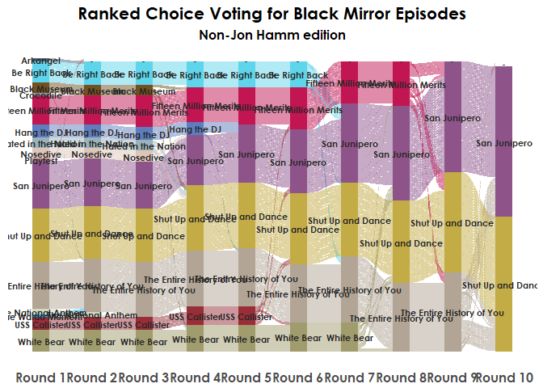<!-- -->

```r
# ggplot(noWC_color, aes(x = round, stratum = episode, alluvium = id,
#                        fill = color, label = episode)) +
#   theme(panel.background = element_blank(),
#         axis.ticks = element_blank(),
#         axis.text.y = element_blank(),
#         axis.text.x = element_text(size = 14),
#         axis.title = element_blank(),
#         text = element_text(family = "Century Gothic", face = "bold"),
#         plot.title = element_text(hjust = 0.5, size = 20)) +
#   geom_flow(stat = "alluvium", lode.guidance = "leftright") +
#   geom_stratum(size = 0, color = NA, na.rm = TRUE) +
#   scale_fill_identity() +
#   ggtitle("Ranked Choice Voting for Black Mirror Episodes") +
#   geom_text(stat = "stratum", family = "Century Gothic", fontface = "bold", color = "gray15") +
#   scale_x_continuous(breaks = seq(1,10,1), labels = c("Round 1", "Round 2", "Round 3",
#                                                      "Round 4", "Round 5", "Round 6",
#                                                      "Round 7", "Round 8", "Round 9",
#                                                      "Round 10"))
```

https://cran.r-project.org/web/packages/ggalluvial/vignettes/ggalluvial.html
